<div align="center">

# Event Horizon

**Crowd intelligence for live venues — with the evidence boundary drawn on screen.**

A 3D venue digital twin, a constant-velocity concentration forecast, a deterministic
incident engine and an evidence-bounded operator assistant. Every number in the
interface is labelled *observed*, *simulated* or *unavailable*, and nothing in this
system claims that a crowd is safe.

[](https://www.python.org/)
[](https://fastapi.tiangolo.com/)
[](https://react.dev/)
[](https://threejs.org/)
[](https://streamlit.io/)
[](#testing)
[](#limitations-and-responsible-use)

**Sharvesh K** · **Darshan P Pawar**
<br><sub>PES University, Bengaluru</sub>

</div>

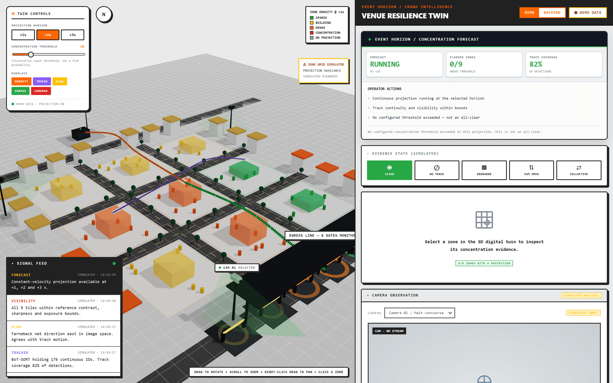

---

## Contents

- [The problem](#the-problem)
- [What Event Horizon does](#what-event-horizon-does)
- [Screenshot tour](#screenshot-tour)
  - [The 3D digital twin](#the-3d-digital-twin)
  - [Zone telemetry](#zone-telemetry)
  - [The five evidence states](#the-five-evidence-states)
  - [Backend mode](#backend-mode)
  - [Incident response and SOPs](#incident-response-and-sops)
  - [The operator assistant](#the-operator-assistant)
  - [The integration API](#the-integration-api)
- [Architecture](#architecture)
- [Repository layout](#repository-layout)
- [Quickstart](#quickstart)
- [API reference](#api-reference)
- [How the concentration forecast works](#how-the-concentration-forecast-works)
- [Testing](#testing)
- [Limitations and responsible use](#limitations-and-responsible-use)
- [Roadmap](#roadmap)
- [Further reading](#further-reading)

---

## The problem

Crowd-safety software fails in a specific and dangerous way: it keeps producing
confident numbers after the evidence behind them has gone. A lens gets sprayed, a
camera is knocked, the tracker loses every identity — and the dashboard still shows a
crowd count, still draws a heatmap, still reports a trend. An operator reads a calm
screen and concludes the concourse is calm.

Event Horizon is built around the opposite commitment. **Missing evidence is rendered
as missing evidence.** When visibility degrades the forecast is suspended, the zone
grid goes grey, the 3D scene fogs over, and the console says so in words. No state in
this system is ever labelled *safe*.

## What Event Horizon does

| Capability | What it actually is |
| --- | --- |
| **Head detection and tracking** | YOLO head checkpoint + BoT-SORT over recorded video, a local webcam or RTSP. Counts are boxes returned by the tracker, not verified site occupancy. |
| **Scene motion** | Farnebäck dense optical flow, aggregated over a 3×3 grid. This is *scene* motion in image pixels/second, not person motion. |
| **Visibility reference** | Per-tile contrast, sharpness and exposure compared against the first three seconds of a clear view. A relative degradation check, not an occlusion detector. |
| **Concentration forecast** | Least-squares constant-velocity extrapolation of continuous tracks into 3×3 cells at +1 s, +2 s and +3 s. A baseline, not a trained congestion classifier. |
| **Incident engine** | Deterministic priority rules over the observation, each mapped to a sample SOP. No model, no probability, no automatic action. |
| **3D digital twin** | A React Three Fiber venue plaza whose zones, corridors, cameras, gates and atmosphere are all driven by the same evidence the console shows. |
| **Operator assistant** | Answers grounded strictly in the supplied incident and SOP. Falls back to a deterministic scripted answer whenever no LLM key is configured or a call fails. |
| **Offline classifier** | A small Random Forest baseline over reviewed, human-labelled windows, with event-level split checks. Ships untrained — no real-data model is included. |

---

## Screenshot tour

> Every screenshot below was captured from the running application. The zone grid is
> labelled **SIMULATED** because the API currently reports `forecast_available: false`;
> the console flips it to **BACKEND EVIDENCE** automatically the moment the backend
> starts returning a real `observation.forecast` payload.

### The 3D digital twin

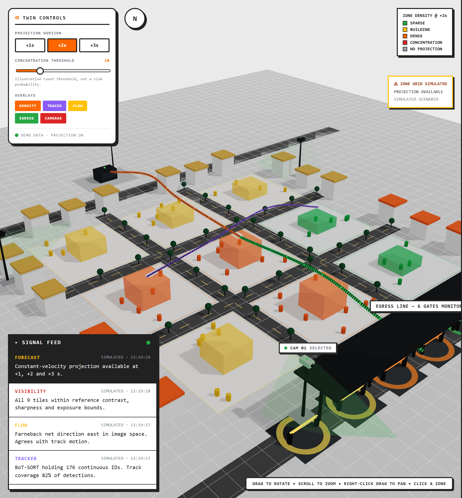

The left pane is the venue, not a decoration. The scene *is* the 3×3 analysed region
from `crowd_forecast.py`, laid out as a plaza with the same zone naming the Python
baseline uses — `R{row}C{col}`, rows top to bottom, columns left to right.

| Scene element | What it is bound to |
| --- | --- |
| Zone tile + density column | one forecast cell; column height is projected tracks ÷ threshold |
| Column colour | sparse → building → dense → concentration, **grey when there is no projection** |
| Pulse ring under a zone | `concentration_flag` set for that cell at the selected horizon |
| Crowd markers | `current_eligible` per zone, capped at 26 markers — illustrative positions only |
| Flow corridors | the reported dominant direction; a reversal renders as a red counter-flow |
| A violet corridor with no green one | optical flow is available but person motion is not |
| Camera masts and cones | venue camera geometry; the console's selected camera is highlighted |
| Egress gates | ring pulse rate follows the feeding R3 zone's projected occupancy |
| Fog, dimmed light, camera shake | visibility degraded, tracking unavailable, camera movement suspected |

### Zone telemetry

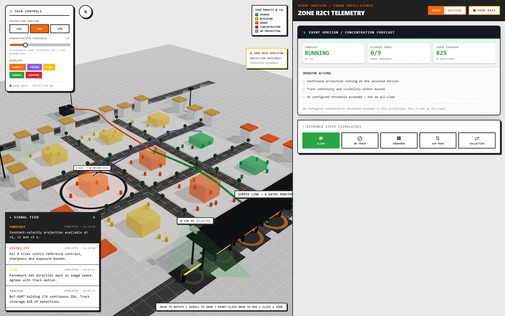

Clicking a zone rings it in the twin and opens its evidence in the console: current
eligible tracks, the projection at the selected horizon, the change between them, the
observed slow fraction, this zone's share of projected region occupancy, and the
projection curve against the configured threshold.

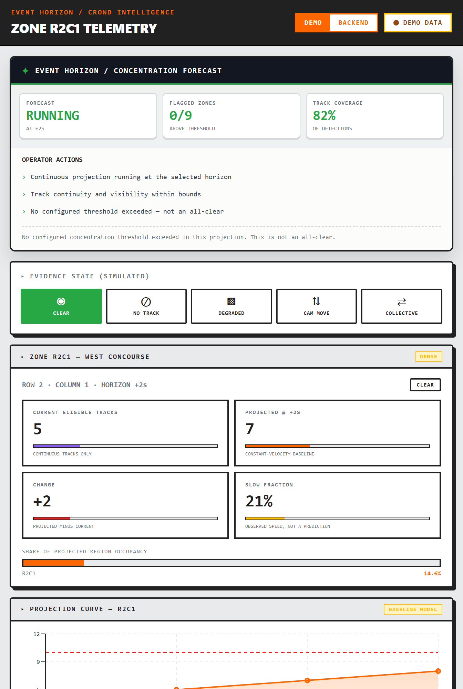

Note what each caption refuses to claim: *current eligible tracks* says
`CONTINUOUS TRACKS ONLY`, the projection says `CONSTANT-VELOCITY BASELINE`, and the
slow fraction says `OBSERVED SPEED, NOT A PREDICTION`.

### The five evidence states

The console and the twin both render five distinct evidence states. Four of them are
failures — and the interface is at its most informative when the evidence is worst.

<table>
<tr>
<td width="50%">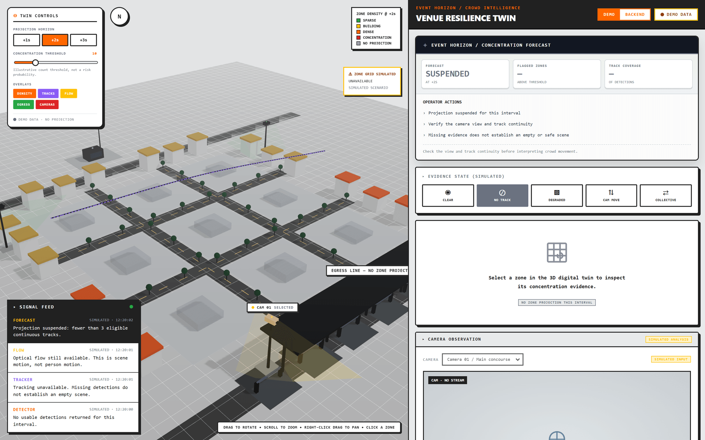</td>
<td width="50%">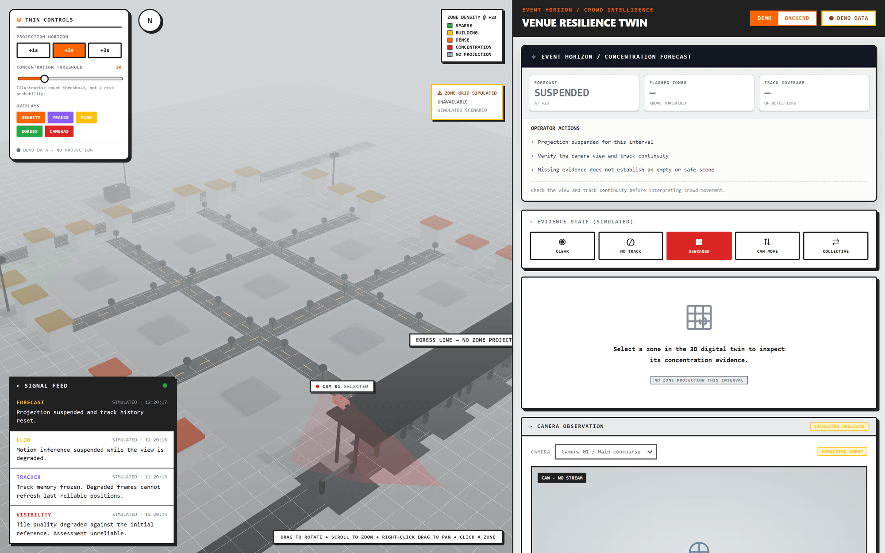</td>
</tr>
<tr>
<td><b>Tracking unavailable</b> — no usable detections. Optical flow survives and draws
a lone violet corridor, because scene motion is not person motion. The forecast is
suspended: <i>missing evidence does not establish an empty or safe scene.</i></td>
<td><b>Visibility degraded</b> — tile quality has fallen against the reference. The
scene fogs and desaturates, track memory freezes so degraded frames cannot refresh
last reliable positions, and projection history is reset.</td>
</tr>
<tr>
<td width="50%">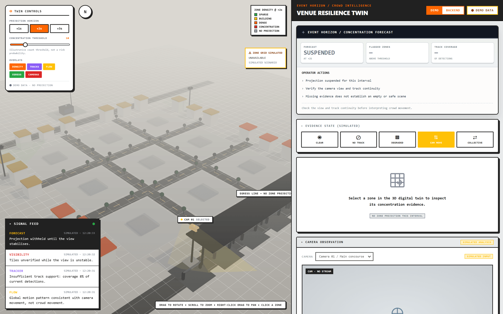</td>
<td width="50%">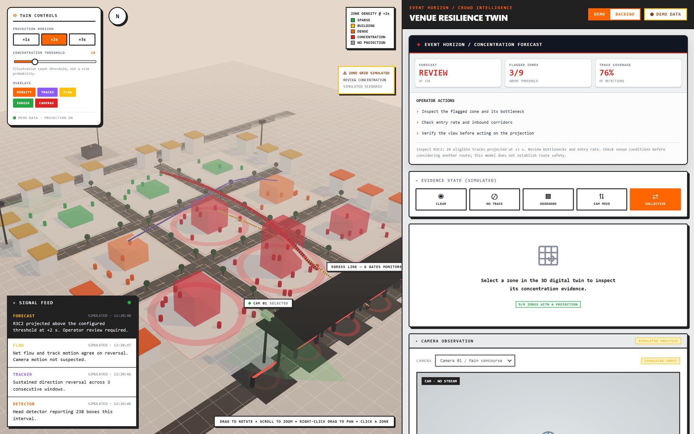</td>
</tr>
<tr>
<td><b>Camera movement suspected</b> — the global motion pattern is consistent with the
camera moving rather than the crowd. The 3D view physically shakes, and projection is
withheld until the view stabilises.</td>
<td><b>Unusual collective movement</b> — a sustained direction reversal agreed by both
track motion and net flow. Three zones cross the threshold and the console asks for
<i>review</i>, not action. This is a verification alert, not a validated surge probability.</td>
</tr>
</table>

### Backend mode

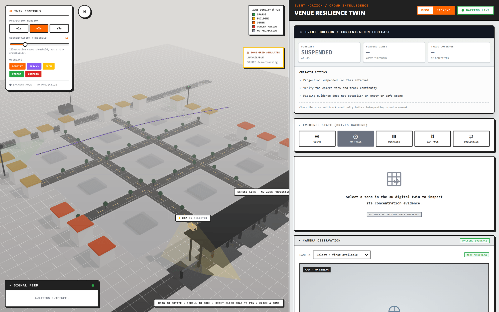

In `backend` mode the console polls `/api/healthz`, `/api/cameras`, `/api/incidents`
and the selected camera's status every two seconds. The header pill goes
**BACKEND LIVE**, the evidence-state buttons switch from simulating locally to driving
`POST /api/demo/scenario`, and panel tags change from `SIMULATED ANALYSIS` to
`BACKEND EVIDENCE`.

Backend mode never silently falls back to demo data. A failed read shows
**DISCONNECTED**; an observation older than ten seconds shows **STALE**.

### Incident response and SOPs

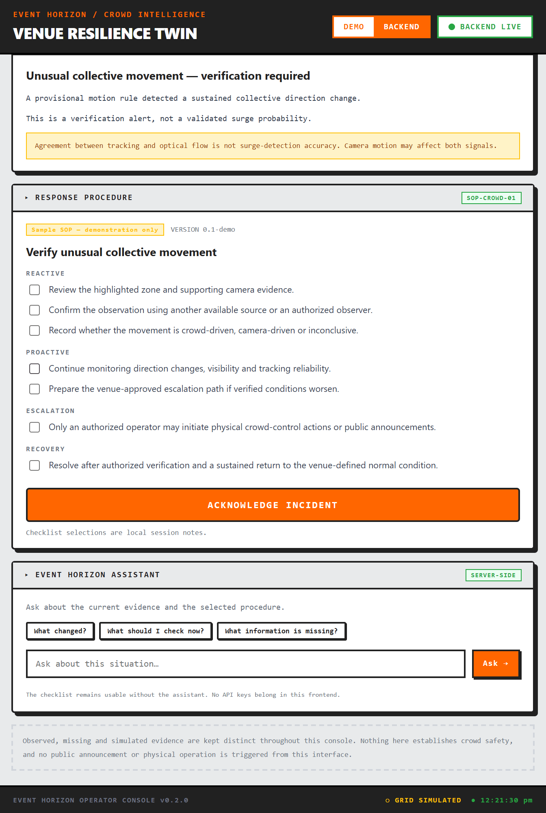

The incident engine picks exactly one highest-priority incident from the observation
using deterministic rules — visibility before camera motion, camera motion before
tracking loss — and attaches bounded evidence plus a sample SOP with reactive,
proactive, escalation and recovery steps.

The escalation step is the point of the whole panel: *only an authorised operator may
initiate physical crowd-control actions or public announcements.* Nothing in this
console triggers a gate, an announcement or a dispatch.

### The operator assistant

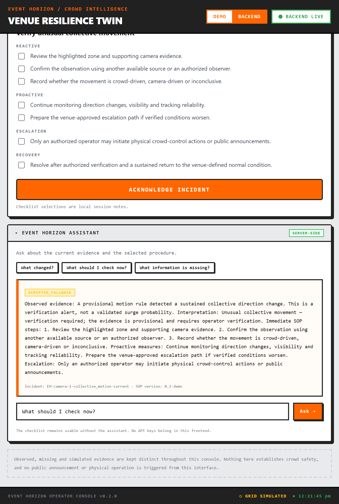

The assistant answers only from the supplied incident evidence and SOP text. With no
`OPENAI_API_KEY` configured it returns the deterministic scripted answer shown above,
tagged `SCRIPTED_FALLBACK` so a fallback can never be mistaken for a model answer. An
LLM call that fails or times out degrades to the same answer and never blocks the SOP.
The checklist is fully usable with the assistant switched off entirely.

### The integration API

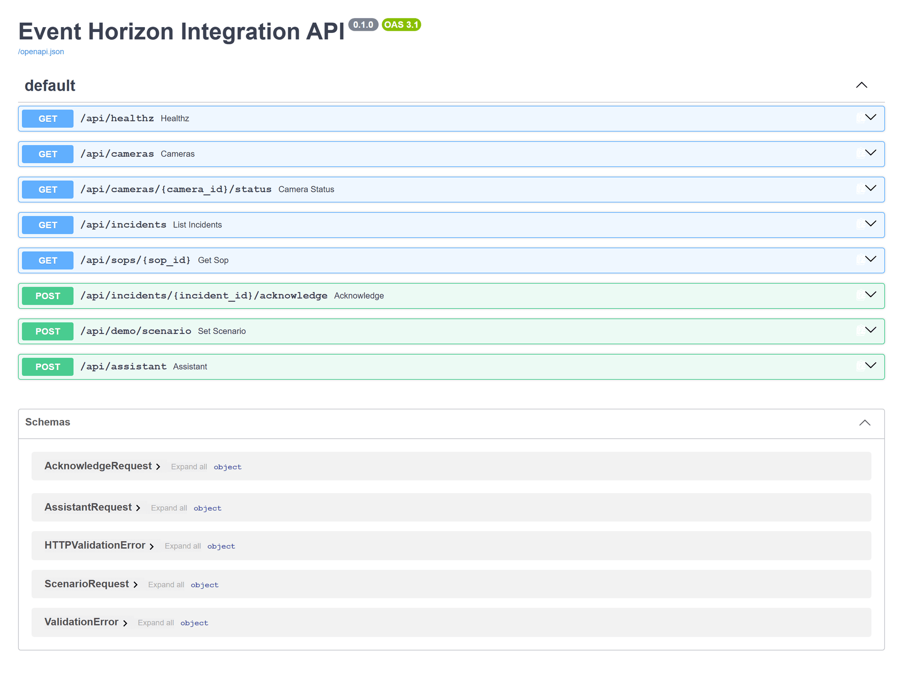

FastAPI serves interactive docs at `http://127.0.0.1:8000/docs`.

---

## Architecture

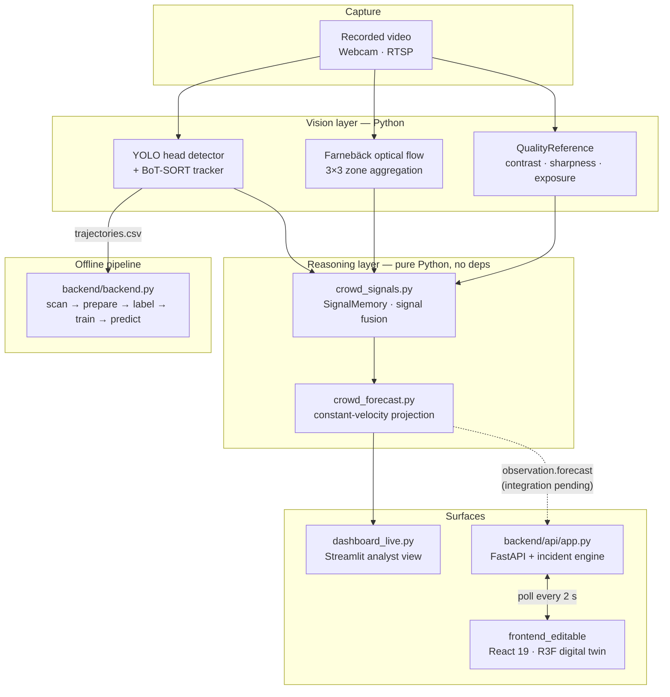

Two design rules hold the system together:

1. **The reasoning layer has no dependencies.** `crowd_signals.py`,
   `crowd_forecast.py`, `backend/flow_field.py` and `backend/trajectory_features.py`
   are standard-library Python. They are unit-testable without a GPU, without OpenCV
   and without video, which is why the test suite runs anywhere.
2. **Provenance is a first-class type.** `PROVENANCE` in `frontend_editable/src/theme.js`
   defines three visually distinct states — observed, simulated, unavailable — and every
   panel, tag, banner and 3D material resolves through it.

---

## Repository layout

```text
event-horizon/
├── crowd_signals.py            QualityReference + SignalMemory; provisional signal fusion
├── crowd_forecast.py           3×3 constant-velocity concentration baseline
├── dashboard_live.py           Streamlit operator/analyst view
├── dashboard_worker.py         background video processor (no Streamlit calls on this thread)
├── track_people.py             recorded-video tracking → trails, trajectories.csv, metadata
├── crowd_network.py            tracked observations → dynamic crowd network
├── visualize_network.py        network overlay renderer from existing CSV output
├── smart_visibility_overlay.py visibility-aware overlay post-processed from trajectories.csv
├── compare_flow_tracks.py      synchronised 3×3 flow vs. trajectory comparison
├── prepare_scut_head.py        SCUT-HEAD VOC download → documented YOLO subset
│
├── backend/                    offline pipeline and detector-independent flow
│   ├── backend.py              CLI: scan · prepare · label · train · predict
│   ├── flow_field.py           zone motion + frozen-field tracer projections
│   ├── trajectory_features.py  causal full-view training windows (stdlib only)
│   ├── extract_tracks.py       detector + tracker extraction to an analytics folder
│   ├── extract_flow.py         standalone optical-flow extraction (no checkpoint needed)
│   ├── train_flow_experiment.py fixed-configuration same-scene diagnostic
│   └── api/                    integration API
│       ├── app.py              FastAPI app, demo scenarios, assistant endpoint
│       ├── incident_engine.py  deterministic incident rules
│       └── sops.json           four sample SOPs (demonstration content only)
│
├── frontend_editable/          operator console + 3D digital twin
│   └── src/
│       ├── theme.js            design tokens and the PROVENANCE contract
│       ├── data/venueModel.js  venue geometry and the simulated forecast grid
│       ├── store/              zustand state, polling, pure derivations
│       └── components/
│           ├── digitalTwin/    VenueScene · VenuePlaza · ZoneTile · CrowdParticles ·
│           │                   CrowdFlow · CameraMasts · ExitGates · SceneEffects
│           └── dashboard/      ForecastPanel · ZoneTelemetry · CameraPanel ·
│                               ResponsePanel · AssistantPanel · ScenarioControls
│
└── docs/screenshots/           the images in this README
```

---

## Quickstart

### Prerequisites

| Component | Requirement |
| --- | --- |
| Operator console | Node 20 or newer (built and tested on Node 24) |
| Integration API | Python 3.11+ and `backend/api/requirements-api.txt` |
| Offline pipeline | Python 3.11+ and `backend/requirements-backend.txt` (NumPy, scikit-learn, joblib) |
| Streamlit dashboard | the above **plus** a working CUDA PyTorch, Ultralytics, OpenCV and `lap` install, and a head-detection checkpoint |

The requirements files are deliberately overlays, not clean-machine lockfiles: they add
what is missing to an existing working CUDA environment rather than trying to reinstall
your PyTorch build.

### 1 · Console + API (no GPU, no model weights, no video)

This is the path every screenshot above was captured from. Two terminals:

```powershell
# Terminal 1 — API
python -m venv .venv
.\.venv\Scripts\Activate.ps1
python -m pip install -r .\backend\api\requirements-api.txt
python -m uvicorn app:app --app-dir .\backend\api --host 127.0.0.1 --port 8000
```

```powershell
# Terminal 2 — console
cd frontend_editable
npm install
Copy-Item .env.example .env
npm run dev
```

Open <http://127.0.0.1:3000>. The console starts in `demo` mode with everything
scripted locally; switch the header toggle to `backend` to poll the API. Vite proxies
`/api` to `BACKEND_URL`, so the browser only ever talks to one origin.

Drive the backend's evidence state from the console's **EVIDENCE STATE** buttons, or
directly:

```powershell
Invoke-RestMethod -Method Post -Uri http://127.0.0.1:8000/api/demo/scenario `
  -ContentType application/json -Body '{"scenario":"collective"}'
```

Allowed scenarios: `clear`, `tracking`, `visibility`, `camera`, `collective`.

`npm run build` produces `dist/`; serve it behind a reverse proxy that routes `/api` to
the Python API. `vite preview` does **not** supply the API.

### 2 · Live video dashboard

Requires your existing CUDA/Ultralytics environment and a head checkpoint.

```powershell
.\.venv\Scripts\Activate.ps1
python -m pip install -r requirements-dashboard.txt
python -m unittest test_crowd_signals test_crowd_forecast
python -m streamlit run dashboard_live.py
```

Choose **Local video**, point it at your clip and your head checkpoint (default
`outputs/training/head_trial/weights/best.pt`). Start with GPU 0 and input size 1280;
drop to 960 or 640 if CUDA memory runs out. Leave the full frame selected for the first
run, then pick a stable ROI and restart — the first three seconds of a clear view
establish the image-quality reference, so start with a clean shot.

Runs write `signals.csv`, `concentration_forecasts.csv` and `summary.json` under
`outputs/dashboard_runs`. Details and the full validation plan are in
[README-forecast.md](README-forecast.md) and [README-dashboard.md](README-dashboard.md).

### 3 · Offline pipeline

```powershell
# inventory a dataset
python .\backend\backend.py scan --root "D:\PATH_TO_DATASET" --output .\outputs\dataset_inventory.json

# trajectories → causal training windows
python .\backend\backend.py prepare --trajectories .\outputs\analytics_*\trajectories.csv `
  --video-id recording_b --output .\outputs\training_data\recording_b

# join human review to features (labels a state at t+2 s from history through t)
python .\backend\backend.py label --features ...\features.jsonl `
  --labels ...\labels_to_review.json --output ...\labelled.jsonl

# train the Random Forest baseline against an event-grouped manifest
python .\backend\backend.py train --manifest .\backend\examples\training_manifest.json `
  --output .\outputs\models\crowd_event_v1

# offline inference
python .\backend\backend.py predict --model ...\model.joblib --features ...\features.jsonl `
  --visibility ...\labels_to_review.json --output ...\predictions.jsonl
```

The example manifest is intentionally incomplete and must be populated before training.
Full guidance on annotation, event grouping and split-leakage checks is in
[backend/README.md](backend/README.md).

---

## API reference

Base URL `http://127.0.0.1:8000`. Interactive docs at `/docs`.

| Method | Path | Purpose |
| --- | --- | --- |
| `GET` | `/api/healthz` | liveness, current mode and server timestamp |
| `GET` | `/api/cameras` | available cameras with connection state and data origin |
| `GET` | `/api/cameras/{camera_id}/status` | current observation, limitations and optional `forecast` |
| `GET` | `/api/incidents` | zero or one active incident with bounded evidence |
| `GET` | `/api/sops/{sop_id}` | sample SOP: reactive, proactive, escalation, recovery |
| `POST` | `/api/incidents/{incident_id}/acknowledge` | memory-only acknowledgement + operator note |
| `POST` | `/api/demo/scenario` | switch the demonstration evidence state |
| `POST` | `/api/assistant` | evidence-bounded answer; `response_origin` is `llm` or `scripted_fallback` |

Every observation carries `data_origin` (`demo` today), `received_at`,
`forecast_available` and an explicit `limitations` list. Timestamps describe
**observation delivery**, and the API never fabricates a fresh capture time.

### Optional LLM

Create `backend/api/.env` locally — never commit it:

```ini
EH_SCENARIO=tracking
OPENAI_API_KEY=sk-...
OPENAI_MODEL=gpt-5-mini
```

The key stays server-side. The frontend holds no keys, and the SOP flow works
identically whether or not a key is present.

---

## How the concentration forecast works

`CrowdForecast.update()` is roughly 60 lines of dependency-free Python, and most of
them are refusals.

**Preconditions — any failure suspends the forecast and clears history:**

- image quality must be `REFERENCE-LIKE`
- the motion signals must not be in a `SIGNALS DISAGREE` state
- at least **3** eligible tracks must exist
- eligible tracks must cover at least **60 %** of current detector/tracker boxes

**For each surviving track:**

- keep up to 1 s of recent positions, requiring ≥ 3 observations spanning ≥ 0.3 s
- discard the history on any gap over 0.5 s
- fit velocity by least squares over that window, which smooths position jitter
- extrapolate to +1 s, +2 s, +3 s and bin the projected position into a 3×3 cell
- drop projections that leave the analysed region — people exiting are not retained

Current and projected counts are computed over the **same eligible subset**, so the
change between them is comparable. Remembered ("ghost") positions are never used for
either. A raised `concentration_flag` means one thing only: *the configured
illustrative count threshold was exceeded in this projection.*

### What this is not

- Not a trained congestion or surge classifier
- Not a probability of a dangerous event
- Not a people-per-square-metre estimate — equal image cells cover unequal physical areas
- Not a total site population — displayed counts are visible detections
- Not evidence of route safety; the model infers no forces, no pressure and no intent

---

## Testing

```powershell
# reasoning layer (pure Python, no GPU, no OpenCV)
python -m unittest test_crowd_signals test_crowd_forecast -v

# incident rules
python -m unittest discover -s .\backend\api -p "test_*.py" -v

# offline pipeline
python -m unittest discover -s .\backend -p "test_*.py" -v
```

Verified on this checkout (Windows 11, Python 3.14):

| Suite | Tests | Result |
| --- | ---: | --- |
| `test_crowd_signals.py` + `test_crowd_forecast.py` | 16 | ✅ pass |
| `backend/api/test_incident_engine.py` | 4 | ✅ pass |
| `backend/test_flow_field.py` | 8 | ✅ pass |
| `backend/test_crowd_signals.py` | 8 | ✅ pass |
| `backend/test_trajectory_features.py` | 2 | ✅ pass |
| `backend/test_backend.py` | — | ⚠️ not exercised here — the scikit-learn/SciPy DLLs are blocked by this machine's Application Control policy, so the module cannot import |

The tests cover exactly the failure modes the product claims to handle: memory expiry,
degraded-view gating, velocity gaps, opposed motion, missing signals, tile quality
loss and recovery, coverage loss, visibility resets, missing track IDs, counterflow,
stale observations, annotation boundary conditions, temporal label alignment and
event-split leakage.

**Not covered anywhere in this repository:** GPU inference, sustained FPS, real video
extraction, capture-to-display latency, webcam and RTSP paths, and UI rendering. Those
require the target machine and the target camera.

---

## Limitations and responsible use

This is a prototype. Read this section before pointing it at anything real.

**On the evidence**

- The default data origin is `demo`. No live video analysis is connected to the API.
- Detected heads are not verified site occupancy; the tracker may omit unconfirmed detections.
- Optical flow responds to water, background and camera motion. Opposing directions can cancel in aggregate.
- The visibility heuristic is a relative check against a clear reference. It can miss textured obstructions and it can produce false alarms. It has not been calibrated for spray or smoke.
- A reference-like view and agreeing motion directions do **not** establish safe conditions, accurate counts or reliable identity continuity.
- File timestamps assume a constant frame rate. Camera buffering and dropped frames are unmeasured.

**On the outputs**

- Sample SOPs are demonstration content, not venue-approved operating procedures.
- The collective-motion rule is a simulated verification alert, not a validated surge predictor. Agreement between tracking and optical flow is not surge-detection accuracy.
- Uncalibrated class scores from the offline baseline are not real-world risk probabilities. A model trained without a surge class cannot claim surge detection.
- Incident acknowledgement is held in memory and resets when the API restarts. SOP checkboxes are local session notes.

**On the system**

- No authentication, audit database, rate limiting, schema validation at runtime, or production deployment hardening.
- No automatic security call, public announcement, gate change or physical action is implemented anywhere in this repository, and none should be added without venue approval and a human in the loop.
- Load only `joblib` models you produced yourself.

**Before claiming improved accuracy**, annotate held-out clips from the intended
camera, separated by event and by video from training. Measure head precision/recall
and per-frame count error; compare projected against annotated future cell counts at
each horizon; measure false alerts and missed annotated congestion events; and measure
capture-to-display latency and sustained FPS on the target hardware. None of that has
been done.

---

## Roadmap

- [ ] Emit `observation.forecast` from the API in the shape `CrowdForecast.update()` already produces — the console then flips the zone grid from simulated to observed with no UI change
- [ ] Recorded and live analytics adapter behind the API, replacing the demo scenarios
- [ ] Join the nine optical-flow zones into classifier training features (currently full-view only)
- [ ] Zone-level rather than full-view event labelling and classification
- [ ] Automatic camera-motion compensation and reliable occlusion detection
- [ ] Browser stream rendering with synchronised video overlays
- [ ] Incident lifecycle persistence, authentication and an audit trail
- [ ] Event-level lead time and false-alerts-per-hour metrics
- [ ] A trained temporal model over labelled cell occupancy, speed, inflow/outflow and visibility history that beats the constant-velocity baseline on held-out events

---

## Further reading

| Document | Covers |
| --- | --- |
| [README-forecast.md](README-forecast.md) | the concentration forecast in depth, interpretation, outputs and the validation plan |
| [README-dashboard.md](README-dashboard.md) | the Streamlit dashboard, input paths, ROI selection and run outputs |
| [backend/README.md](backend/README.md) | dataset scanning, feature preparation, annotation review, event-grouped training and offline inference |
| [backend/api/README.md](backend/api/README.md) | the integration API, scenarios and the assistant |
| [frontend_editable/README.md](frontend_editable/README.md) | the console, the twin's data bindings, modes and the backend contract |

---

<div align="center">
<sub><b>Nothing in this system establishes crowd safety.</b><br>
It reports what the evidence supports, says plainly when it supports nothing, and
leaves every operational decision to an authorised human.</sub>
</div>
